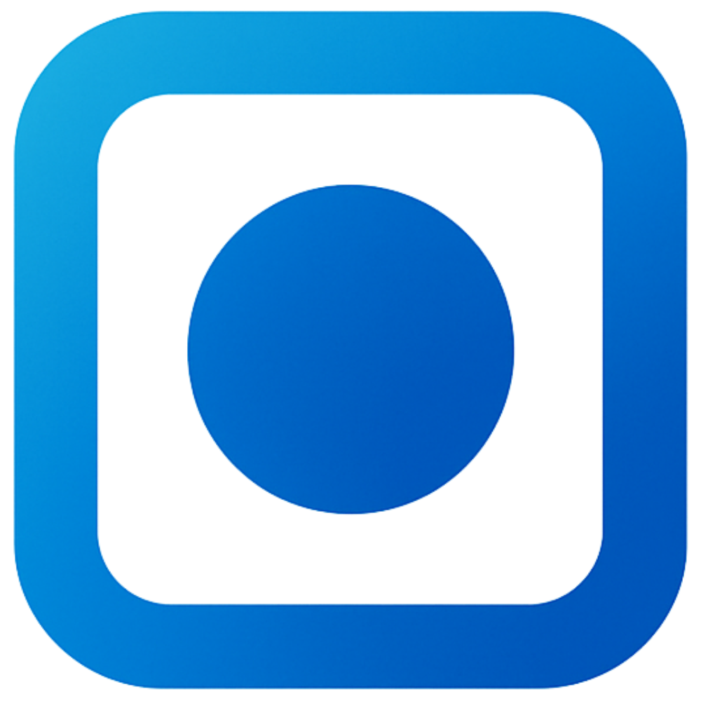

# Laboras



A free and open source productivity application that helps users improve their work efficiency by recording work sessions and providing playback for self-analysis.

## Overview

<div align="left">
      <a href="https://www.youtube.com/watch?v=1J8U1UcUDtI">
         
      </a>
</div>

## Features

- Screen recording with pause/resume functionality
- Session management with tags and notes
- Timestamped note-taking during recordings
- Video playback with session details
- Cross-platform support (Linux, Windows, macOS)

## Installation

Download the latest release for your platform from the [Releases](https://github.com/aeeravsar/Laboras/releases) page.

### Linux
Download and run the AppImage:
```bash
chmod +x Laboras-*.AppImage
./Laboras-*.AppImage
```

### Windows
Download and run the installer exe.

### macOS
Download and open the DMG file, then drag Laboras to your Applications folder.

## Build
```bash
npm run build:linux   # For Linux
npm run build:win     # For Windows  
npm run build:mac     # For macOS
```

## License

[GPL-2.0](LICENSE)
